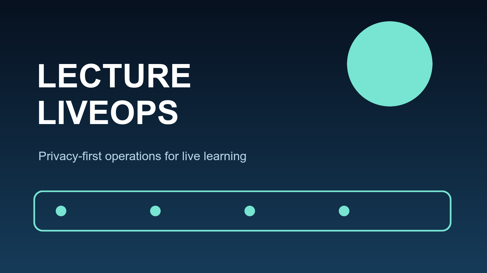
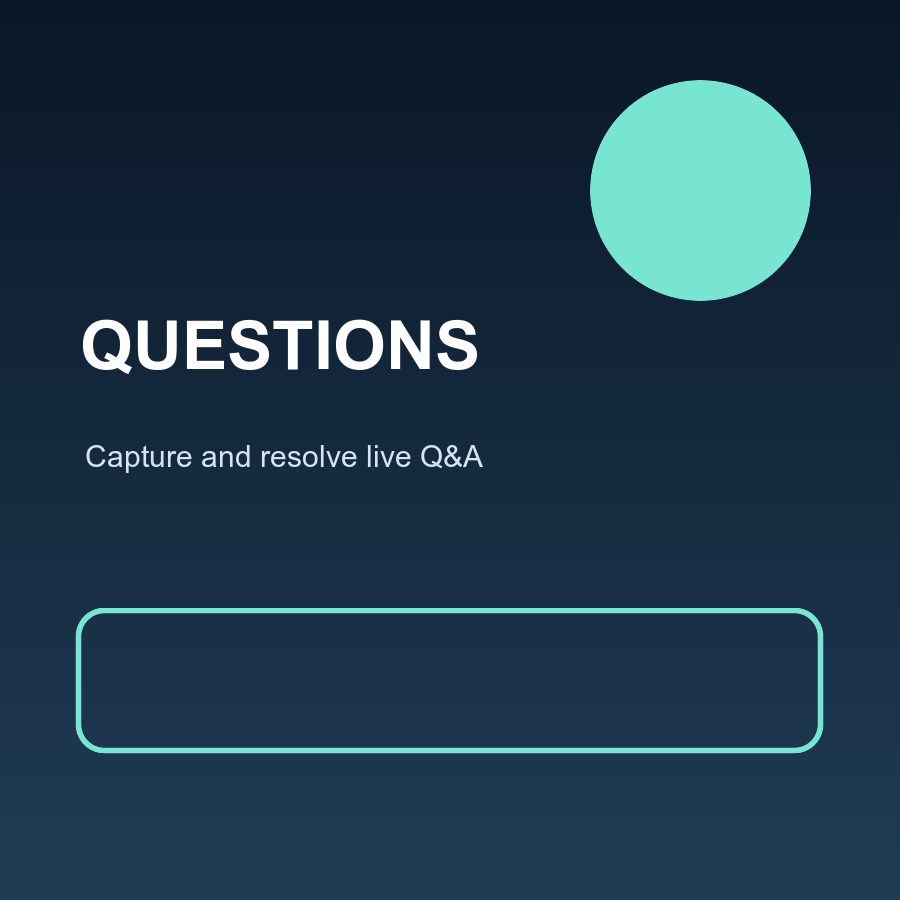
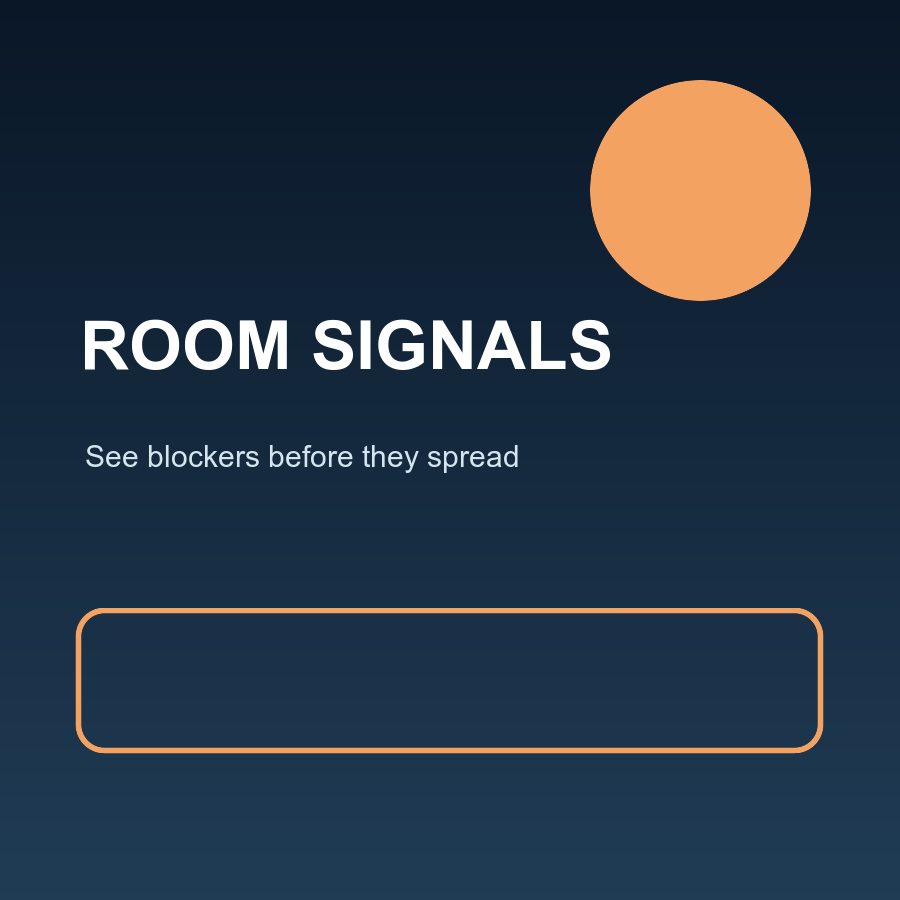
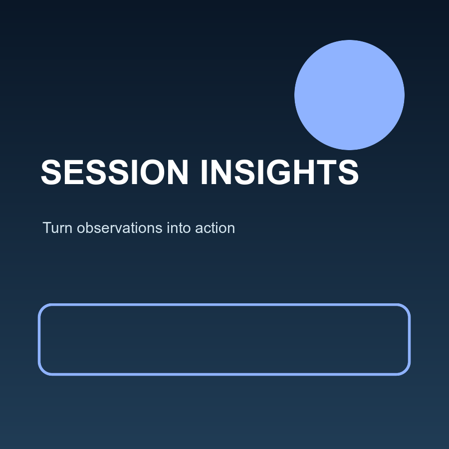
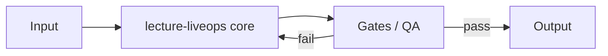
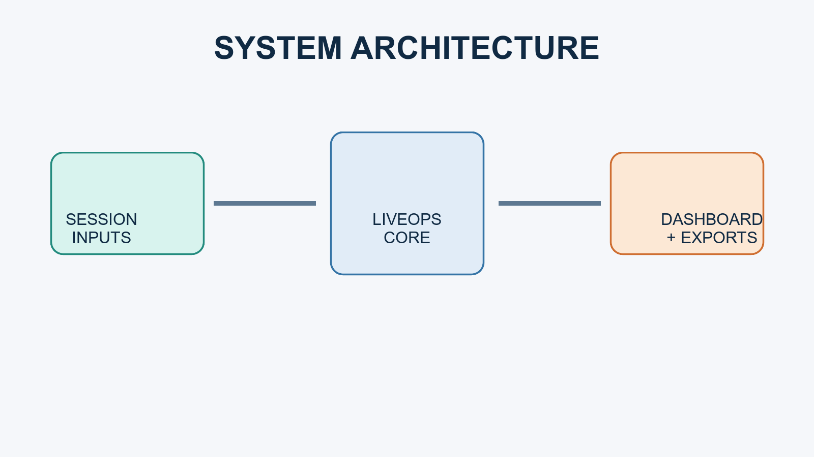

[English](README.md) | [한국어](README.ko.md)

[English](README.md) | [한국어](README.ko.md)

<div align="center">

# lecture-liveops



lecture-liveops — a project.

       

</div>

---

## 🌟 Highlights

- ⚡ **lecture-liveops** — lecture-liveops — a project.
- 🧩 type: `node` 프로젝트, 한 번에 셋업.
- 🔒 안전 기본값 — 시크릿 누출 차단, private 문서 분리.
- 📈 Conventional Commits + 자동 CHANGELOG + semver 릴리스.

## 🚀 Quick Start

```bash
git clone https://github.com/Son/lecture-liveops.git
cd lecture-liveops
make init        # 또는 프로젝트 진입점 실행
```

See [CONTRIBUTING.md](CONTRIBUTING.md), [SECURITY.md](.github/SECURITY.md), and [SUPPORT.md](.github/SUPPORT.md) for project documentation.

## 📸 Gallery

| | | |
|---|---|---|
|  |  |  |

## 📊 Architecture





## 🤝 Contributing

이슈와 PR을 환영합니다. [PULL_REQUEST_TEMPLATE](.github/PULL_REQUEST_TEMPLATE.md) 와 [SECURITY](.github/SECURITY.md) 를 확인하세요.

## 📝 License

MIT © 2026 Son — [LICENSE](LICENSE)
